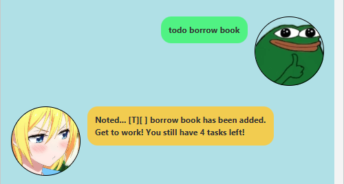
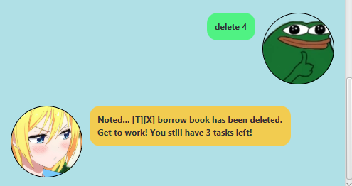

# Tsundere User Guide

Watched too much anime but still can't get enough of your favourite tsundere waifu? 
Look no further! Your friendly ~~(or not)~~ Tsundere chatbot assistant is here as your personal task manager!

## Setting Up
All you need to do is, 
1. Ensure you have Java `11` installed in your computer. [How to check](https://www.baeldung.com/java-check-is-installed)
   - If you do not have Java `11`, download it from [here](https://www.oracle.com/java/technologies/javase/jdk11-archive-downloads.html)
   - Help with configuring correct Java version: [Windows](https://www.happycoders.eu/java/how-to-switch-multiple-java-versions-windows/) | [MacOS](https://stackoverflow.com/questions/21964709/how-to-set-or-change-the-default-java-jdk-version-on-macos) | [Linux](https://www.baeldung.com/linux/java-choose-default-version)
1. Download the latest ``tsundere.jar`` release file from [here](https://github.com/macareonie/ip/releases/).
1. Copy the downloaded file to the folder you want to use as the _home folder_ for your Tsundere Task Assistant.
1. Double click the `tsundere.jar` file. Alternatively, for users with command line experience, open up your favourite terminal and navigate to the directory using `cd` and type the command `java -jar tsundere.jar`.

Now the GUI would have popped up and you can start managing your tasks!

## Adding Tasks

There are three types of tasks which can you add: ToDos, Events and Deadlines.

__Format:__ 
 - `todo [task]`
 - `event [task], from [ ], to [ ]`
 - `deadline [task], by [YYYY-MM-DD]` 

__Things to note:__
 - Omit the square brackets `[]` when entering the commands
 - Adding events currently supports any input for the `from` and `to` fields
 - Adding deadlines currently supports only the data format `YYYY-MM-DD`

 

A confirmation response will be seen once a task has been successfully added with the notation `T`, `E` and `D` denoting _ToDos_, _Events_ and _Deadlines_ respectively.

## Listing Tasks

You can list all recorded tasks.

__Format:__
- `list`

 

## Deleting Tasks

You can delete tasks based on their index or task number.

__Format:__
- `delete [task number]`

__Things to note:__
- Omit the square brackets `[]` when entering the commands
- Inputting invalid task numbers will prompt you with the proper command format

 

A confirmation response will be seen once a task has been successfully deleted.

## Additional Features

1. Marking and Unmarking tasks
2. Tagging and Untagging tasks
3. Finding tasks by keyword

__Format:__
- `mark [task number]`
- `unmark [task number]`
- `tag [task number] [tag name]`
- `untag [task number] [tag name]`
- `find [keyword]`

__Things to note:__
- Omit the square brackets `[]` when entering the commands
- Inputting invalid task numbers will prompt you with the proper command format
- You can tag each task with a maximum of 3 unique tags
- The find command is currently case-sensitive

 

Tasks are unmarked by default denoted with `[ ]` while marked tasks are denoted with `[X]`.
 
Tagged tasks have their tags appended after their description. Eg. `...borrow book #fun...`.

## Getting help

If you can't be bothered to read the rest of the User Guide or if you need help while using the program. `help` displays all the available commands.

__Format:__
- `help`

 

## Exiting program and Saving data

__Format:__
- `bye`

Typing `bye` exits the program and automatically saves the current session data into a `data.txt` file. A new `data.txt` will be created if one doesn't exist already.

## FAQ

Q: Can I edit the data file directly or transfer it to another device?  
A: Data storage is done by converting each task and their details to strings and parsing them when loading it for a new session. As such, invalid changes to the `data.txt` file could cause problems and it is not recommended to directly edit the file.
To transfer data to another device, just copy the `data.txt` file to the `data` directory of the `tsundere.jar` file.